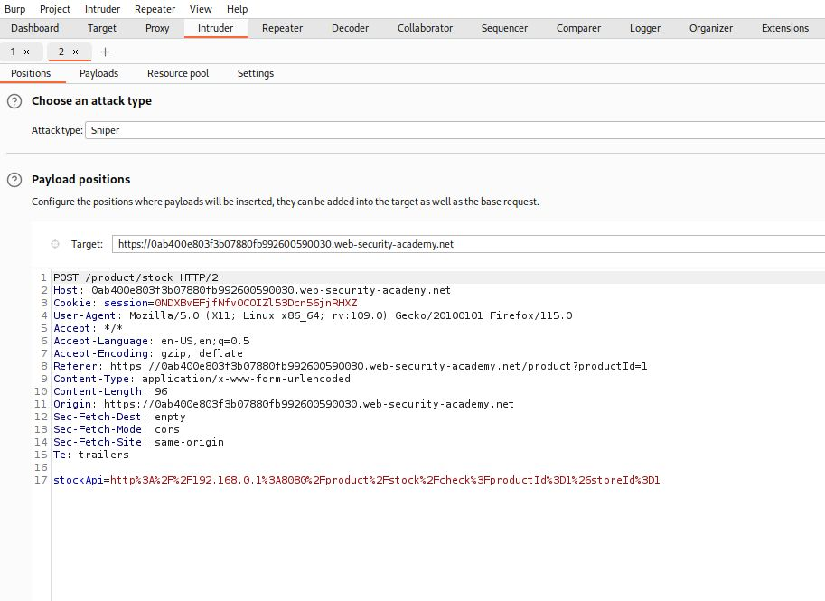

This lab has a stock check feature which fetches data from an internal system.

To solve the lab, use the stock check functionality to scan the internal `192.168.0.X`range for an admin interface on port `8080`, then use it to delete the user `carlos`.

After starting the lab we go to the stock change feature and capture the request using burpsuite.

After capturing it we send the request to intruder 

At **StockApi** we will write http://192.168.0.1:8080/admin (url encoded) then set a payload to the last digit of ip address

then we will go to the payloads section to configure our payload like the image given below

after this we will click on start attack and look for status code 200

After selecting the request with 200 status code right click and select **show response in browser**

Copy the url and paste it on the browser and you will see this

All of these to find the right internal IP address which is for our case is **192.168.0.192**

Now we will go back to our Intruder attack and from the request we will send it to repeater then we will go to to response and there we will see delete account option for carlos

We will use this Carlos delete accont url in the request we send to repeater which is
http://192.168.0.192:8080/admin/delete?username=carlos and also url encode it

Now we send the request and by doing that it will solve the lab.

