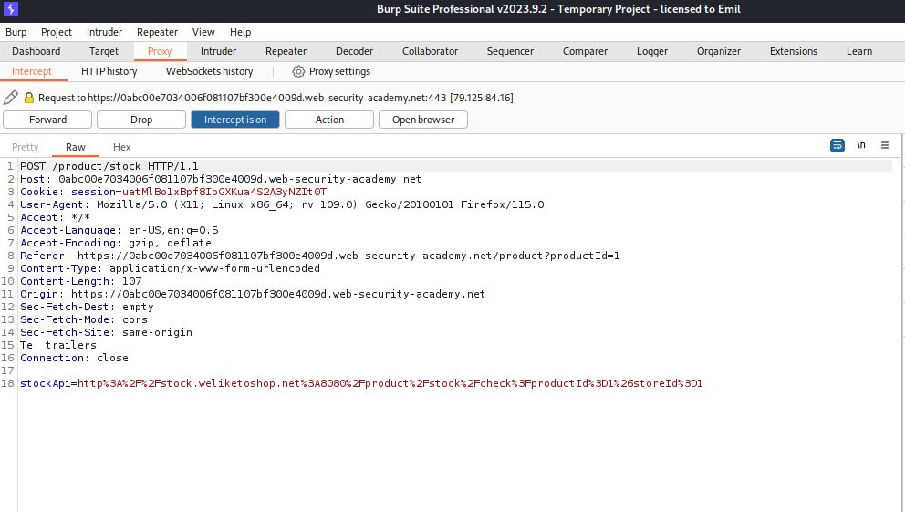
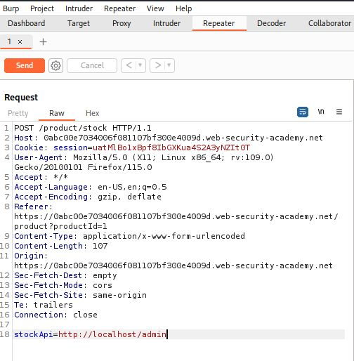
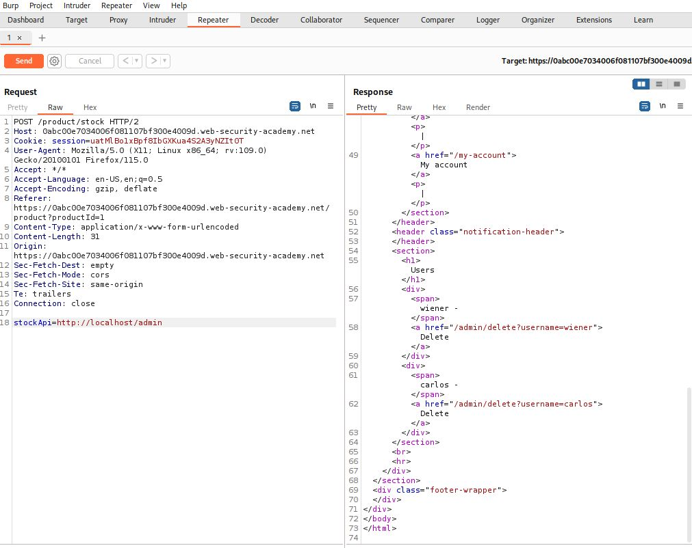
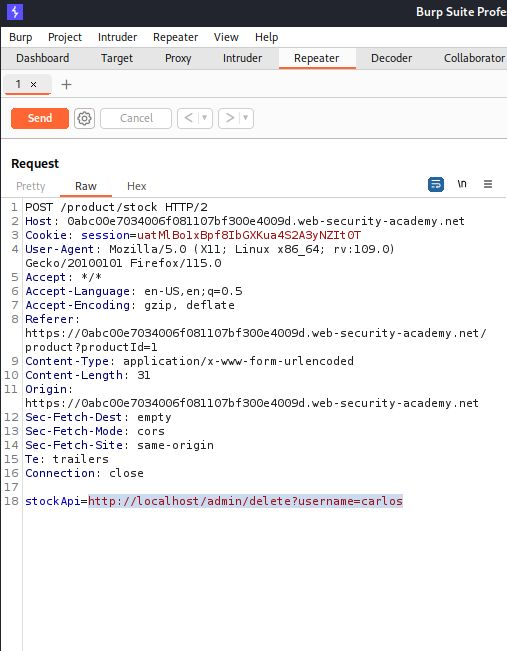
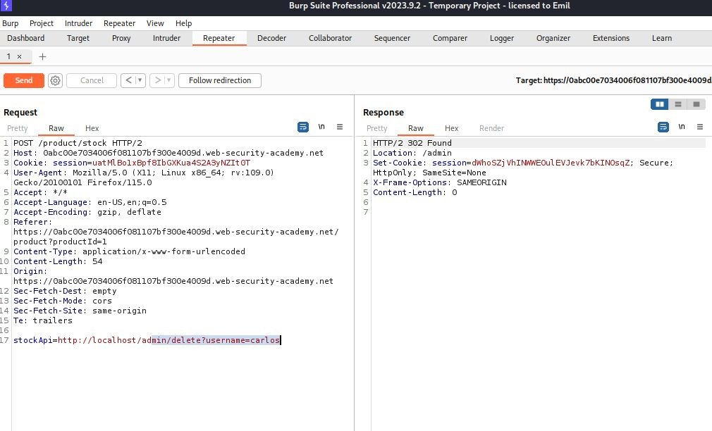
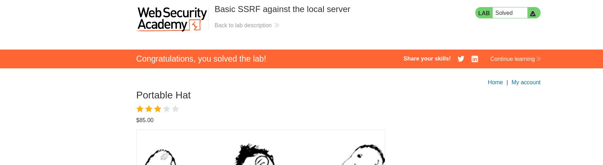

This lab has a stock check feature which fetches data from an internal system.

To solve the lab, change the stock check URL to access the admin interface at http://localhost/admin and delete the user carlos.

After starting the lab we go to the stock change feature and capture the request using burpsuite.

Then we send the request to repeater and at **stockApi** we write http://localhost/admin

Now we send the request

Our objective is to delete the user Carlos to do that at **stockApi** we will write
http://localhost/admin/delete?username=carlos

We will send this request and by doing so it will solve the lab.

